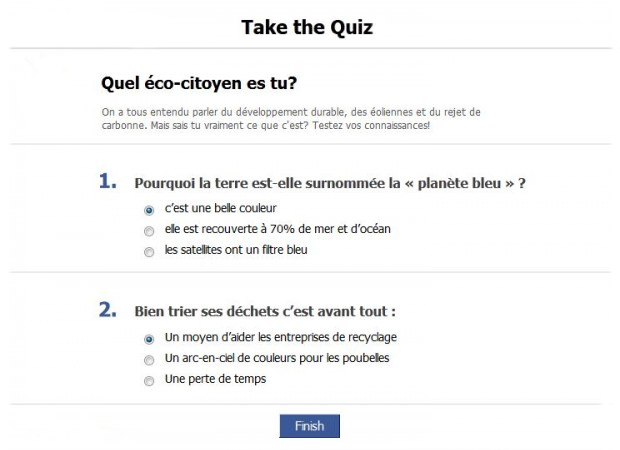

# Projet : QCM
- Durée : 1 semaine
- Emplacement : [GitHub](https://github.com/) sur un repository intitulé "`projet-2-QCM`"

## Demande client
Je suis professeur à BeCode et j'aimerais soumettre mes étudiants à un QCM.
Le but du QCM c'est qu'ils puissent savoir où ils en sont donc je n'ai pas besoin 
**à priori** de recevoir le résultat. 
Mes QCM sont en général simples, il n'y a que **10 questions** et **il n'y a qu'une réponse valable par question**.

Je voudrais que le résultat s'affiche sur **une nouvelle page** avec la mention _"Ta note est de x/10"_ par exemple. 

J'aimerais que mon QCM ressemble à quelque chose comme ceci : 

N'hésite pas à faire plus beau.


## Simple QCM

### Étape 1 : Planifier le travail à effectuer
- Etude de la demande
- Unified Modeling Language (UML) ([example 1](http://astah.net/features/uml-features/uml-features-class.png), [example 2](http://msoe.us/taylor/tutorial/se1021/exceptionUML.png))
- Crée un repository sur GitHub 

### Étape 2 : Le formulaire 

- HTML sémantique _(aide : [html5doctor](http://html5doctor.com/))_
- Implémenter le framework : [Bootstrap](http://getbootstrap.com/)
- Pour tester **rapidement** commencer par réaliser le formulaire en HTML avec 3 questions comme ceci :

```
1 : La bonne réponse est A ?
- Réponse A
- Réponse B
- Réponse C

2 : La bonne réponse est B ?
- Réponse A
- Réponse B
- Réponse C

3 : La bonne réponse est C ?
- Réponse A
- Réponse B
- Réponse C
```
**Après** vous ferez avec 10 questions

### Étape 3 : Envoyer le formulaire

- Réaliser l'envoi du formulaire vers un fichier **PHP**
- Traiter les données en **PHP** pour afficher un note finale

### Étape 4 : Amélioration HTML

- Ajouter un champ **nom, prénom**
- Mettre d'autres questions et réponses ([exemple](/Quizz))  
- Améliorer la mise en page de la note finale ([exemple](layout.jpeg))  
- Valider le HTML par le [W3C](https://validator.w3.org/).

### Étape 5 : Pour aller plus loin

- Ajouter un champ **email** pour l'étudiant
- Valider l'email de l'étudiant en **PHP** (`filter_var()`)
- Si l'email est **valide** alors envoyer le résultat à l'etudiant par **email** (`mail()`)
- Envoyer le résultat aussi au formateur à : **"ton@email.com"**


## Améliorer

### Validateur de QCM
- Crée une autre **branche** nommée **"validator"**
- Crée deux fichier `QCM-1.html` et `QCM-2.html`
- Crée un fichier `resultat.php`
- Dans chaque fichier **HTML** crée des questions et réponses **différentes**
- Faire de sorte que les deux QCM envoient les réponses au même fichier **resultat.php**. 
- Ce même fichier **resultat.php** devra retourner une note selon les réponses pour les deux fichiers **HTML** 

_Consigne_ : Ici on assume que les étudiants ne savent pas activer l'inspecteur et voir le code HTML

_Astuce_ : La bonne réponse peut être envoyée de manière cachée dans le formulaire


### Générateur de QCM
- Crée une autre **branche** nommée **"generator"**
- Crée un fichier `QCM.php`
- Dans ce fichier crée un `array()` pour stoquer tes questions et réponses
- Générer un formulaire à partir de ce tableau (`foreach`, `for`,`while`)
- Faire de sorte que le formulaire généré soit envoyé à `QCM.php`
- Afficher en rouge les mauvaises réponses et en vert les bonnes réponses 
- Ajouter l'envoie du résultat par email à **l'étudiant** et au **formateur**
- Bonus : retirer un point quand une réponse est mauvaise
- Bonus : afficher une alerte (bootstrap) pour dire que le résultat à bien été envoyé


