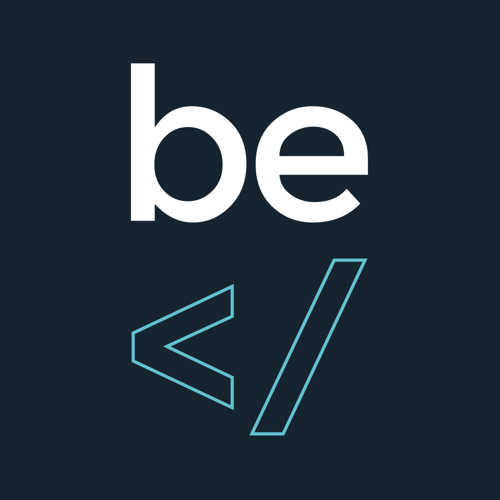

# CSS Challenge: Animated BeCode Logo

## The need
BeCode needs a "please wait while loading" animation. They would like to have the same strategy as Android, Slack or Ryver : a visual play on the logo.

## The mission
Design and develop an animation based on the BeCode logo. 

- make it so that it can loop indefinitely.
- make it lightweight (try to keep it below 100ko).
- use only html, svg and css. No javascript.
- make it last a few seconds.

### Examples

- [Android 6 loading animation (youtube)](https://www.youtube.com/watch?v=Fh67AysLALE)
- [Google Loading](https://codepen.io/brycesnyder/pen/GpRYWV)
- [Have a Beer](https://codepen.io/alistairtweedie/pen/GgPBqP)
- [Gravity](https://codepen.io/pnowell/pen/xZpdqR)

## The logo
Choose one of these : 

You will first need to vectorize it.

### Inspiration
First, you need to plan and scenarize your animation. Feel free to use pen and paper. 

Here is [a gallery of animated logos](http://bpando.org/2014/10/14/the-best-of-bpo-animated-logos/
) to inspire your own research. 

Here is a great selection of codepens of [15 interesting animated text effects](http://www.hongkiat.com/blog/css-text-effects/).

### Start by learning the techniques

Here are two useful tutorials :

- css-tricks: [animating svg](https://css-tricks.com/animating-svg-css/) 
- Smashing Magazine: [Styling And Animating SVGs With CSS](https://www.smashingmagazine.com/2014/11/styling-and-animating-svgs-with-css/)

## Done ? 

Publish your project on codepen.io and send the URL to your coach on Ryver.
Here is an example of what we expect to receive: [Wufoo SVG Add](https://codepen.io/pixeline/pen/mqRBdR)

## Going further

Improve your animation's swag by using the best js animation library : [GreenSock](https://greensock.com/)
