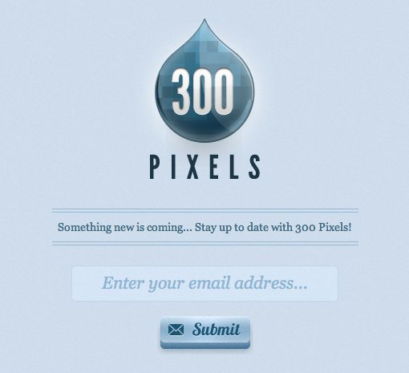
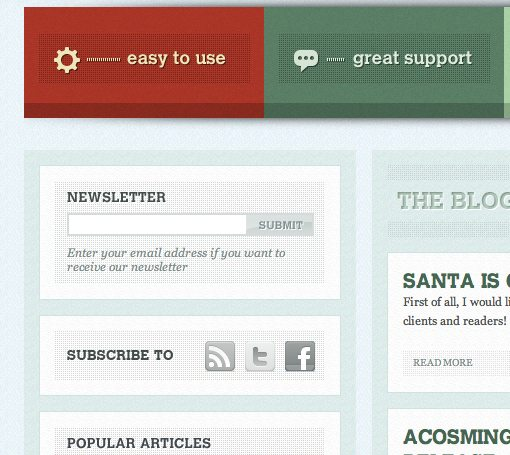
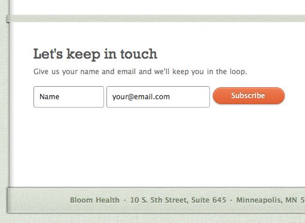
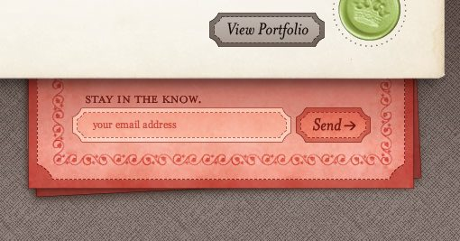
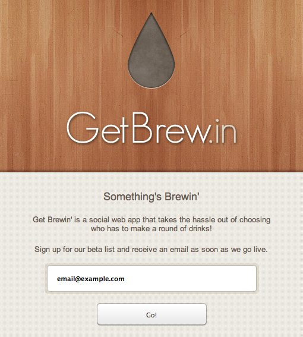

# Projet : Beta Signup form
## Context

You've been hired by a startup called "Ubeer". It offer a 24H beer delivery service anywhere in Belgium, with a focus on cities with a high amount of higher education institutions (universities and colleges).

Their flagship application is well under development and the launch is scheduled in a few weeks.

The CEO wishes that the website announces this launch and invites visitors to sign up to a mailinglist so that they can be informed when the product is finally released. #growth_hacking.

## Your mission

In a team of two (one frontend, one backend), build a signup form (the only required field is the email address). Build also another "administration" page, allowing to view the list of signups and edit/delete each entry. 

Make it fast, because every minute lost means less email signups.

Build it so that you can easily reuse it in the future...

Deadline: today, 16h45.  #sprint_mode.

## Objectives

- Practice your new php/mysql skills to a real use case scenario.
- Use the rapid development strategy used for the one-pager to quickly come to a production-ready result : html template and/or css frameworks are to be used.

## Project steps
- work in a team of two
- assign each other one of these roles : "fronted" (focus on clean html/css integration) / "backend" (focus on functionality and data correctedness).
- create a repo, set its collaborators
- discuss your working plan
- get to work.
- Done ? Use this form to send both the sourcecode url (github) and the UX url (where we can test and try to break your signup form).

## What matters
- clean UX (simple and efficient, reusable, valid html)
- SQL: use PDO and prepared queries
- PHP: data sanitization +  validation before Insertion in DB.
- No bug
- Respect of deadline and constraints

## Inspirations

