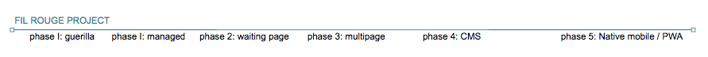

# Projet "Fil Rouge"

Ces projets ont pour objectif :

- que chaque apprenant(e) dispose au terme de la formation, sur son repo des produits digitaux types :

  - one-pager (qui passe le lighthouse test haut la main)
  - mobile native appsite 
  - multipage
  - 1 CMS custom
  - 1 progressive web app (idem: qui passe le lighthouse test haut la main)

- Apprendre à travailler en équipe :

  - utilisation de git en groupe"passer le relai" et inversément, 
  - reprendre un projet en cours de construction

- Vivre les étapes de conception d'un projet de A (la demande client) à Z (publication en ligne et documentation)

- Avoir une épreuve certificative pour l'attribution de badges de compétences techniques

## Modus operandi

Chaque projet est inspiré de situations et besoins réels, mais ne fera pas l'objet d'une remise à un client "réel". Ce client sera interprété par un membre du staff de BeCode.

Les projets sont découpés en phases, dans un processus itératif (chaque phase profite des acquis de la phase précédente). À chaque phase, le projet change de main, et de classe. Il faut donc que l'équipe menant le projet se discipline à mettre à jour les outils de gestion du projet (outils associés au repo github : le repos, le wiki, les issues, le kanban ("github project"). L'outil central étant le "readme.md" du repos du projet, qui pointera vers les différentes ressources et incluera un planning constamment mis à jour. Le repository passera donc de main en main au fur et à mesure de la réalisation de ses phases de développement.

**Temps nécessaire estimé** pour la réalisation des projets : 2 - 4 mois.

## Les phases

### kickoff: identifier des projets

### Phase 1 (guerilla style) : un one-pager en 24 heures.

**Objectifs d'apprentissage**

* voir comment réaliser rapidement un site web, sur base de templates existants. Guerilla style. 

* Comprendre par l’absurde l’intérêt de bien comprendre une demande avant de coder.

**À livrer**

Tu reçois un projet. Réalise, en quelques heures un onepager (une **github page**) qui propose une meilleure version de ce projet, en utilisant soit un[ framework CSS](http://cssframeworks.org/), soit un template (par exemple :[ html5up.net](https://html5up.net/)). Veille à ce que cette page obtienne un **score maximum sur le lighthouse test**.

Durant cette phase, le respect de la deadline est **primordial et non négociable**.
______________

### Phase 1 : (managed style) : étude de la demande

#### Objectifs d’apprentissage

- Trouver les questions à élucider pour pouvoir produire un projet digital sur de bonnes bases et qui soit une réponse pertinente à un problème donné.
- Explorer Google Analytics

#### Déroulement

**TL;DR;** Le groupe identifie les besoins du client et se rédige un briefing détaillé en posant toutes les questions qui lui semblent pertinentes au client.

La phase précédente répondait à des scénarios d'urgence. À présent, entrons dans un schéma d'un projet classique où tu as le temps nécessaire pour travailler méthodiquement. Durant cette phase, le client répond à toutes les questions que se pose l'équipe en charge de la solution. Qui est le client ? Quelle est son activité ? Qui sont ses concurrents ? Quel est le problème à résoudre ? Qui sont les publics-cible ? Etc, etc... Ces informations sont collectées et mises en forme dans un “cahier des charges” (ou “briefing”), sur le repository du projet (soit dans le repos même, soit dans le wiki qui l'accompagne).

#### Séquences pédagogiques

- Répartition des groupes (3 max par groupe)
- Le groupe se met d'accord sur le projet, en choisissant celui qui fait consensus parmi les 3 one-pager de la phase précédente.
- brainstorming de groupe : quelles questions poser ?
- Faire des recherches du style "web design questionnaire" et ramener un maximum de questions intéressantes à poser au client. Débriefer en groupe.
- Contact avec le "client" : le groupe rencontre le “client” qui répond aux questions, dans chaque groupe.
- Création d'un repos (nom commence par `filrouge-`).
- Rédaction d'un briefing / cahier des charges dans ce repos.
- Livraison du repos au team qui prendra le relai.

#### À livrer

Le repos contenant les outils de gestion du projet et les informations glanées durant l'étude.

- repository,  avec readme.md en markdown comme point de départ de la documentation du projet. ("le client", "le problème / l'opportunité", "objectifs", "publics-cible").
- la doc (wiki du repos ou sous-dossier avec markdown), 
- les issues,
- le kanban de gestion de projet ("github project").
- définir les KPI (Key Performance Indicators) du projet (indicateurs clés de performance) et prévoir de faire leur suivi dans Google Analytics

#### Temps imparti

2 jours, en groupe de 3 max.
______________

### **Phase 2 : Design de la solution "one-pager v2" :**

**Objectifs d’apprentissage**

* UX study d'un onepager responsive, qui annonce l’arrivée prochaine de la solution. Cette page comporte obligatoirement un formulaire d'inscription à une newsletter, fonctionnel, dans une db) ---> UX prototyping via balsamiq et invision

* intégration HTML/CSS de ce onepager

* interaction client/serveur

* ce site contient une table MySQL permettant de recevoir les emails des gens s'inscrivant à la newsletter

* Déploiement sur un hébergeur classique : [https://www.hostinger.fr/](https://www.hostinger.fr/) 

**À livrer **

Dans le repos, ajouter un lien vers les prototype low-def + prototype high-def du onepager sur invision, ainsi que les fichiers du onepager v2.

* prototype low-def (balsamiq + invision.com)

* prototype high-def (figma.com)

* le one-pager en HTML/CSS/JS 

* la page doit obtenir le meilleur score possible au lighthouse test

**Badges**

Possibilité d'obtenir les badges HTML sémantique + CSS + Lighthouse

**Temps imparti**: 3 jours, en groupe de 3 max.
______________

### **Phase 3 : Design d’un "multipage website"**

**Objectifs d’apprentissage**

* interaction client/serveur

* méthode de conception "mobile first"

* utilisation de frameworks CSS

* architecture MVC si ruby/php/python  ou si react/angular/vue.js -> SPA (Single Page Application) framework

**À livrer**

* un prototype interactif d'un site multipages, conçu selon l’approche "mobile first" et utilisant un framework css au choix.

* Si MVC, réalisation de ce site statique à l'aide de HTML, CSS, JS + PHP include() et architecture MVC (sans le M).

* Si SPA, penser à la sémantique (lire sur les [Fragments](https://blog.jmes.tech/react-fragment-and-semantic-html/)), bien séparer les components (1 composant  = 1 molécule en Atomic Design ([lire ceci](http://bradfrost.com/blog/post/atomic-web-design/)) )

* chaque page du site doit obtenir le meilleur score possible au lighthouse test (si React, lire [ceci](https://medium.com/a-man-with-no-server/create-a-progressive-web-app-with-react-792ed8c69bc7) et pour l’accessibilité, lire [ceci](https://reactjs.org/docs/accessibility.html) )

**Badges**

Possibilité d'obtenir les badges HTML sémantique + CSS, UX Prototyping, PHP basics

**Temps imparti**: 5 jours, en groupe de 3 max.

______________

### **Phase 4 : développement d'un Backoffice (CMS)**

**Objectifs d'apprentissage**

* réaliser un CMS de A à Z via MVC framework (pour voir le CRUD)

* base de données

* ajax

**À livrer** 

Permettre au client de mettre à jour lui-même son site par l'ajout d'un CMS "custom", développé sur mesure.

* Prototype (low-fi) de l'interface d'administration du CMS

* interface HTML/CSS/JS de l'administration du CMS, utilisant de l'ajax pour fluidifier l'expérience

**Badges**

Possibilité d'obtenir les badges : MVC dev / OOP / CRUD.

**Temps imparti**: 7 jours, en groupe de 3 max.

______________

### **Phase 5 : Application mobile**

**Objectifs d'apprentissage**

* développer une première application mobile via cordova/ionic

**À livrer** 

Conversion de multipage en app mobile native ou en Progressive Web App (au choix) via un framework tel que Cordova / ionic.

**Badges**

Possibilité d'obtenir les badges : Progressive Web App Builder / Mobile Native Builder.

**Temps imparti estimé si cordova/ionic**: 3 jours, en groupe de 3 max.

